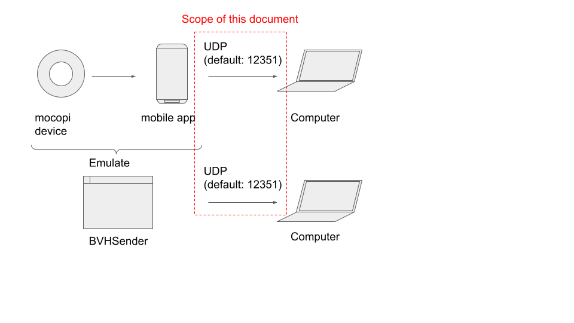
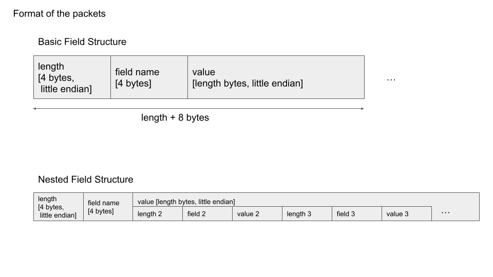
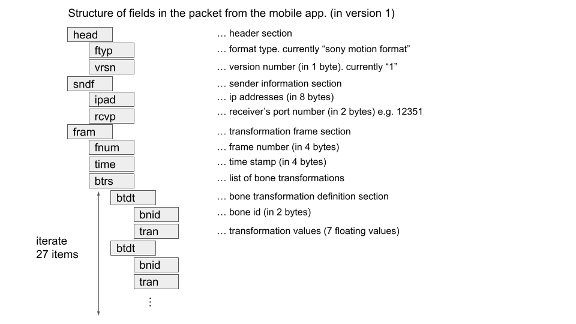

# Protocol Specification
**This document is UNOFFICIAL, and nothing is related to official activities around Sony's mocopi product.**

**This document ensures NOTHING about the accuracy of the technical details. This is just analyzed information observed from UDP packets between BVHSender and Receiver Plugin. This document is published AS-IS and provides NO WARRANTY.**

This document describes the estimated protocol between mocopi mobile application and Receiver Plugin running on the PC.

## Overview
Figure below shows the overview of the communication between mobile app and Computer.
Mocopi device sends sensor data to mobile app (maybe via bluetooth protocol.)
Mobile app transform raw sensors into 27 bone transformation in their application.
Then mobile app sends transformed data to PC, and software (Unity, Motion Builder etc.) processes the passed transformation data.
It seems this protocol is one-way communication. Packets are sent only from mobile app to computer only.

Another program named "BVHSender" is the emulation of the mocopi device and mobile app data.
it sends the transformation data written in BVH format to the computer.

If user want to send tracking data of multiple player, it should send tracking data to another UDP socket of different port.

## Communication between Sender and Receiver
**[Need confirmation]**

Mobile app continues to send updated motion to specified port. No interactive communication is required. Just one-way stream from mobile app to computer.

## Serialization Format
Data sent from mobile app is serialized in special serialization format.
Data format is a set of field, which consists of three part, length, field name, and value data.
Fields are iterated until the end of the packets.
Values are serialized in little endian.

### Basic Field Structure
- `length` specifies the size of value data in bytes.
- `field name` is 4 bytes ASCII data to represent the type of data field.
  You can check list of fields in next section.
- `value` contains actual data for field. Contents depends on the field name.

### Nested Field Structure
Some field have complex structure like in C and other languages. In that kind of complex structure, all data for sub-field is contained in `value` data of parent field.

If `field1` contains sub-field `field2` and `field3`, length, filed name, and value of `field2` and `field3` are packed into `value` data of `field1`.

## Data Structure
Mobile app sends packets which contains following structure.
Packet contains `head`, `sndf` and `fram` fields, and contains several sub-fields inside.

### `head` field
`head` field contains information about packet format and version.
- `ftyp` contains the string which represent the format. Currently, "sony motion format" is used.
- `vrsn` specifies the version number in 1 byte integer. Currently 1 is used.

### `sndf` field
`sndf` field contains the IP addresses and port number information.
- `ipad` represents the IP address in 8 bytes. Maybe containing sender and receiver.
- `rcvp` represents the port number of receiver's side. "12351" is used by default.

### `fram` field
`fram` field contains detailed information of the motion.
- `fnum` specifies the frame number in 4 bytes integer.
- `time` speicifes the time stamp of the motion in 4 bytes integer.
- `btrs` contains set of transformations of the avatar.

### `btrs` field
`btrs` field contains set of transformation definitions (`btdt` section.) Currently this section contains 27 transformation defitnion inside.

## `btdt` field
`btdt` field contains every individual motion definition.
- `bnid` specifies Bone ID. Currently 0 to 26 is used.
  For more details of Bone ID, you can consult [Technical Specification](https://www.sony.net/Products/mocopi-dev/jp/documents/Home/TechSpec.html) of mocopi developer's site.
- `tran` specifies the transformation parameter values. It seems to contain 7 floating values. 

## Bone Transformation Definition
Not yet done

`tran` field contains 7 floating values.
Maybe position and quaternion angles, but not confirmed yet.